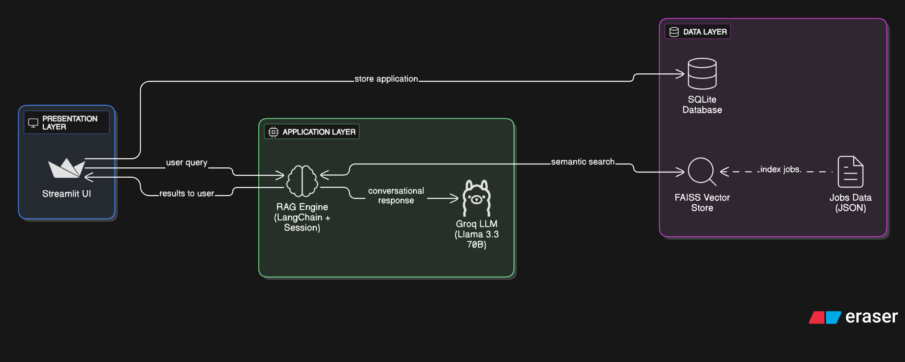

# SmartApply - AI-Powered Job Application Agent

SmartApply is an intelligent RAG-based conversational agent that revolutionizes job searching and applications. With natural language queries, it discovers relevant jobs, guides through applications, and handles screening questions conversationally.



## UI Demo

*Smart job search with semantic matching and filters*

[View all screenshots →](docs/UI_DEMO.md)

## Project Layout

The project is built with a modular three-layer architecture:

### **Presentation Layer (Streamlit Frontend)**

- Interactive web interface for job search and applications
- Real-time job matching with semantic search
- Resume upload and application management
- Admin dashboard for analytics

---

### **Application Layer (RAG Engine)**

- **LangChain-powered** RAG system for intelligent job matching
- **FAISS vector store** with semantic similarity search
- **Groq LLM API** (Llama 3.3 70B) for conversational responses
- **Stateful session management** for multi-step applications

---

### **Data Layer (SQLite Database)**

- Persistent storage for applications and candidate data
- Screening questions and responses management
- Resume file storage and retrieval

---

## Tools and Technologies Used

- **Groq API** (Llama 3.3 70B) - High-speed LLM for conversational AI
- **LangChain** - RAG orchestration and workflow management
- **FAISS** - Vector similarity search for semantic matching
- **Streamlit** - Modern web interface for user interaction
- **SQLAlchemy** - Database ORM for SQLite operations
- **Sentence-Transformers** - Free embeddings for semantic search
- **Python** - Core programming language

## How to Run the Project

1. Clone the repository:
   ```bash
   git clone https://github.com/Raghu-Yadav/Smart-Apply.git
   cd smartapply

2. Create virtual environment:
   ```bash
   python -m venv smartapply_env
   # Windows
   smartapply_env\Scripts\activate
   # macOS/Linux
   source smartapply_env/bin/activate
   ```
3. Install dependencies:
   ```bash
    pip install -r requirements.txt
   ```
4. Set up API keys by creating .env file:
   ```bash
    GROQ_API_KEY=your_groq_api_key_here
    DATABASE_URL=sqlite:///applications.db
   ```
5. Run the application:
   ```bash
    streamlit run app.py
   ```
6. Access the interface at **http://localhost:8501**

## Key Features

✅ **Semantic Job Search** - RAG-powered intelligent job matching with relevance scoring  
✅ **Conversational Interface** - Natural language queries and contextual responses  
✅ **Multi-Step Applications** - Stateful workflow from search to submission  
✅ **Resume Management** - PDF/DOCX upload and storage  
✅ **Screening Questions** - Dynamic Q&A based on job requirements  
✅ **Admin Dashboard** - Application analytics and management  
✅ **Intelligent Caching** - FAISS index persistence and hash-based validation  

---

## Project Structure
```
smartapply/
├── app.py # Streamlit web interface
├── src/
│ ├── rag_engine.py # Core RAG engine and agentic workflow
│ └── database.py # SQLite database management
├── data/
│ └── jobs.json # Sample job data
├── docs/
│ └── System_Design_Document.pdf # Detailed architecture
├── requirements.txt # Python dependencies
├── .gitignore # Git exclusion rules
├── images/ # Documentation images
└── README.md # Project documentation

```
---

## Usage Example

1. **Search Jobs**: "Show me ML engineer positions in Bangalore"
2. **Filter Results**: Use location, salary, and experience filters
3. **Apply**: Click "Apply" on desired job
4. **Submit Information**: Fill personal details and upload resume
5. **Answer Questions**: Complete job-specific screening questions
6. **Get Confirmation**: Receive application ID and status

**Sample Output**: Application stored in database with candidate info, resume, and screening responses.

---


🚀 **SmartApply - The Future of Intelligent Job Applications!**


