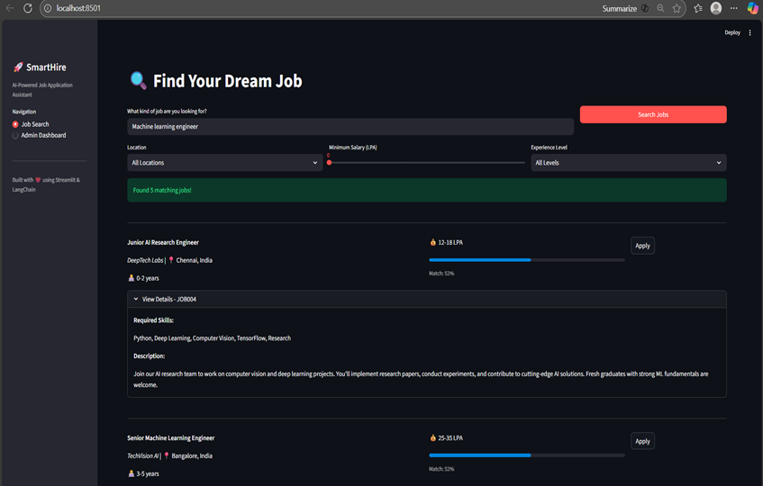

# SmartApply - UI Walkthrough

## 1. Job Search Interface

*Smart semantic search with relevance scoring, filters, and quick apply functionality*

## 2. Application Form  

*Multi-step application form with personal details and resume upload*

## 3. Screening Questions

*Dynamic job-specific screening questions with progress tracking*

## 4. Success Confirmation

*Application submitted successfully with unique tracking ID and confirmation*

## 5. Admin Dashboard

*Comprehensive admin dashboard with application analytics and management*

---

## Workflow Overview

1. **Search & Discover**: Use natural language queries to find relevant jobs with semantic matching
2. **Apply & Submit**: Complete multi-step application with resume upload
3. **Screen & Qualify**: Answer job-specific screening questions
4. **Track & Manage**: Monitor application status and admin analytics

[← Back to Main README](../README.md)
